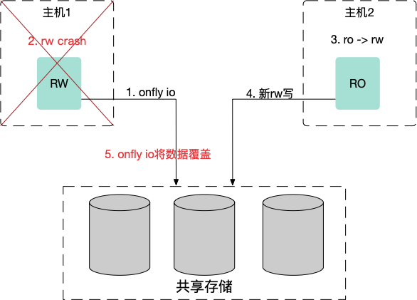
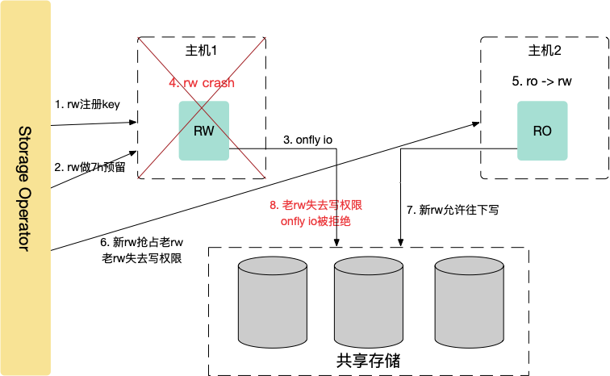
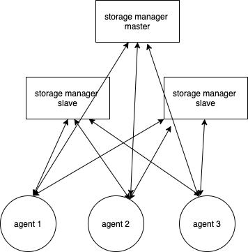

# PolarDB Shared Storage Management

## Introduction

The shared storage management module provides the following functions for the management and control system of PolarDB: create logical volumes, scale out, format the file system, switch between the read-write node and read-only nodes, clean disks, etc. It shields the interference of underlying storage differences on the management and control services and provides a consistent storage model. Usually, we use SAN storage backend disks as the array and the hosts use iSCSI/NVMe protocol to access the LUN of the array. We adopt Persistent Reservation as the readers/writer lock mechanism to solve the problem of mutually exclusive access among multiple hosts and multiple initiator-target connections, which can prevent the disk data from being damaged due to the possibility of onfly io overwriting new data during the process of switching between the write-read node and read-only nodes.

- In the Shared-Storage architecture, the communication among processes or nodes will be restarted after faults. In this case, the old I/O may overwrite the new one, which is referred to as the onfly io problem.

​                            


- The storage management module acts as the coordinator and uses the Persistent Reservation locking mechanism of the storage array to solve the problem as shown below:

​                 

## Overall Architecture

- Logical Architecture

  

  - The API layer provides unified APIs inside the system to connect the upper adaption layer. These APIs are mainly used for console management and database management and control (read/write permission settings).

  - Domain Service: It mainly abstracts the core Domain Entity of the storage model including LUN, LV, and API PVC.

  - Persist Repository: DM-Table (local file), which is used to persist the metadata to the database.

  - HA: It is responsible for leader election among three nodes of sms-manager.

  - Command Pipeline: It is used to convert the domain service to the command pipeline executed by the agent.

  - Message Protocol: The protobuf defines the communication model and communication protocol with the agent. The communication protocol is based on persistent connection and an ACK packet is used for the response.

  - Agent Manager: agent persistent connection management.

  - Agent: It mainly contains tools, commands, and classes that can be used by the hosts.

- Physical Deployment

  

  - sms-manager: three-node deployment that provides services with one primary node and two read-only nodes.

  - sms-agent: The deamon deploys each compute node.


## Quick Start

### Install/Run

Refer to [Install Manually](https://github.com/ApsaraDB/PolarDB-Stack-Operator/blob/master/docs/docs-EN/install-EN.md).

# Document

## API Document

You can use gin-swagger to build and generate the API document following the method below:

```plain
#execute the following command in the root directory of the project
swag init

#local document
./docs
├── docs.go
├── swagger.json
└── swagger.yaml
```

## Compatibility

The storage architecture of PolarDB Stack consists of Control Plane and Data Plane.

- Control Plane: It is responsible for functions such as creating, deleting, scaling out, cloning, and taking snapshots of LUN devices. It interacts with the management and control component of the storage device via SSH CLI or REST API. There is no unified standard for the control plane, which means that commands or APIs provided by devices of different manufacturers may be different. Users should be responsible for the control plane by themselves.
- Data Plane: LUN devices scanned and discovered by the storage management module. It also provides functions such as lifecycle management of the host LUN, creating and formatting logical volumes, scaling out the file system, high availability of data links, and read-write protection and control. There are standard SCSI/NVMe protocols for access, which depends on whether the Persistent Reservation locking is supported. That is to say, only storage devices that meet the requirements of being compatible with SCSI/NVMe can be used.

| Type                                              | Data Plane                                                   |
| ------------------------------------------------- | ------------------------------------------------------------ |
| Compatibility Requirements of SAN Storage         | - It should support FC or iSCSI links.<br />- A LUN has at least two paths.<br />- It should be compatible with the SCSI-3 protocol and support Persistent Reservation-7 mode (Write Exclusive-All Registrants) and Persistent Reservation actions including REGISTER, RESERVE, PREEMPT, RELEASE, and CLEAR. |
| Compatibility Requirements of Distributed Storage | - It should provide the capability of accessing block devices.<br />- It should support read/write control on block devices including two options:<br />    - It is compatible with the SCSI-3 protocol and supports Persistent Reservation-7 mode (Write Exclusive-All Registrants) and Persistent Reservation actions including REGISTER, RESERVE, PREEMPT, RELEASE, and CLEAR.<br />    - It supports the mechanism similar to SCSI PR and the storage management module can be adjusted to adapt to it. |

- Compatibility Detection

```bash
#check_storage.sh is a script used for checking the storage compatibility. If no error is returned, it indicates that the storage compatibility is normal.
sudo ./script/check_storage.sh
```

# Contributing

You are welcome to make contributions to PolarDB. We appreciate all the contributions. For more information about how to start development and pull requests, see [contributing](https://github.com/ApsaraDB/PolarDB-for-PostgreSQL/blob/main/doc/PolarDB-EN/contributing.md).

