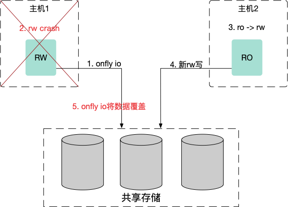
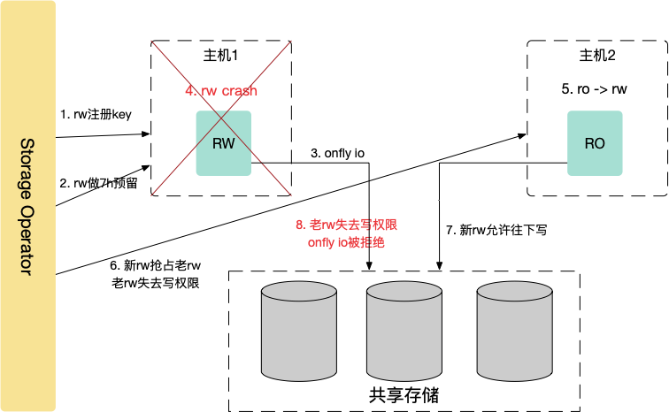
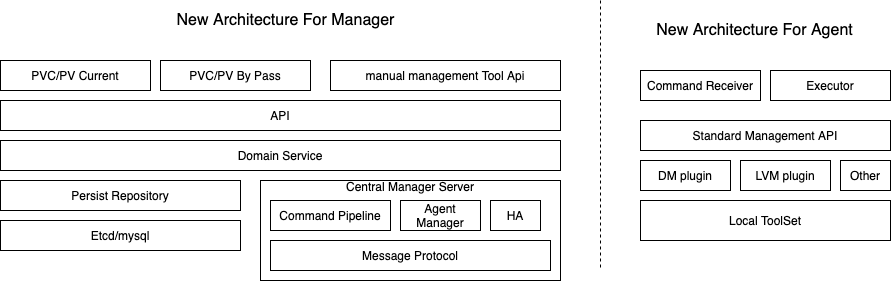
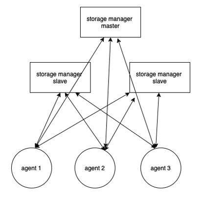

# PolarDB 共享存储管理

## 简介

共享存储管理模块为PolarDB上层管控系统提供：逻辑卷创建，扩容，文件系统格式化，读写切换，磁盘清理等功能，屏蔽底层存储差异对管控业务的干扰，提供一致的存储模型。通常我们会采用SAN存储后端磁盘做阵列，主机使用iSCSI/NVMe协议访问阵列侧的LUN，读写锁机制采用Persist Reservation，解决多主机多IT（Initiator-Target）链接的访问互斥问题，防止读写切换过程可能存在onflyio覆盖新数据的情况发生从而导致磁盘数据损坏。

- 共享存储架构下，进程或者节点之间通讯故障之后重新拉起，老I/O可能会覆盖新I/O，即onfly io问题：

​                            


- 存储管理模块作为协调者，利用存储阵列PersistentReservation锁机制解决，如下：

​                 

## 整体架构

- 逻辑架构



- - API提供系统内部的统一的API，对接上层适配层，主要是提供控制台管理相关的API，以及供DB管控使用的API（设置读写权限）。
- DomainService: 主要是抽象存储模型的两个核心Domain Entity： LUN、LV及接口PVC。

- - Persist Pepository：DM-Table（本地文件）， 持久化元数据到数据库。
- HA：负责sms-manager的3节点选主。

- - Command Pipeline：domain service 转化为 agent执行的command pipeline。
- Message Protocol: protobuf 定义与agent的通信模型， 和通信协议（基于长连接，ack应答）。

- - AgentManager： agent长连接管理。
- Agent侧：主机执行工具命令和执行类为主。

- 物理部署



- - sms-manager：3节点部署， 一主多从服务
- sms-agent：daemon 部署每个计算节点

## 快速入门

### 安装/运行

参考[《安装手册》](https://github.com/ApsaraDB/PolarDB-Stack-Operator/blob/master/docs/install.md)

# 文档

## 接口文档

可以使用 gin-swagger 生成文档。用户可以使用以下方法构建文档：

```plain
#在项目根目录执行以下命令
swag init

#本地文档
./docs
├── docs.go
├── swagger.json
└── swagger.yaml
```

## 兼容性说明

PolarDB Stack存储架构，分为控制平面（Control Plane）和数据平面（Data Plane）。

- 控制平面：负责LUN的创建、删除、扩容、克隆、快照等功能，通过SSH CLI或REST API与存储设备管控交互。控制平面没有统一标准，每个厂商的设备对外提供的命令或API都不一样，由客户的存储管理团队负责。
- 数据平面：存储管理模块扫描发现的LUN设备，并管理主机侧LUN的生命周期，逻辑卷创建、格式化、文件系统扩容、数据链路高可用、读写保护控制等功能，业界有标准的SCSI/NVMe协议访问，依赖支持Persist Reservation锁，所以对存储设备有SCSI/NVMe兼容性要求，只有满足要求的设备才能使用。

| 类型                 | 数据平面                                                     |
| -------------------- | ------------------------------------------------------------ |
| SAN存储兼容性要求    | 支持FC或iSCSI链路Lun至少有2条路径兼容SCSI-3协议，支持Persistent Reservation-7模式（Write Exclusive-All Registrants）。支持Persistent Reservation动作：REGISTER、RESERVE、PREEMPT、RELEASE、CLEAR |
| 分布式存储兼容性要求 | 提供块设备访问能力支持块设备级别的读写控制，有两种选择：兼容SCSI-3协议，支持Persistent Reservation-7模式（Write Exclusive-All Registrants）。支持Persistent Reservation动作：REGISTER、RESERVE、PREEMPT、RELEASE、CLEAR。支持类似于SCSI PR的机制，存储管理可以进行适配。 |

- 兼容性检测

```bash
#检查脚本，对存储的兼容性进行检测，没有报错即为正常。
sudo ./script/check_storage.sh
```

## PR 锁依赖原理说明
[《PolarDB 管控如何保障 DB 一致性》](https://lynnleelhl.github.io/docs/20211206_db_consistency.html)

# License

# 贡献流程
